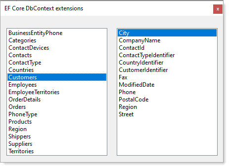

# About

This project provides a visual for inspecting two `DbContext language extensions` that have test methods in NorthWindCoreUnitTest_InMemory project.

Using a Windows Form rather than a ASP.NET Core project is easier where the difference would be more time to setup a web project.

**For web** (using a component from Progress, DevCraft library)

- @(Html.Kendo().ComboBox()
- Set the data source and style

