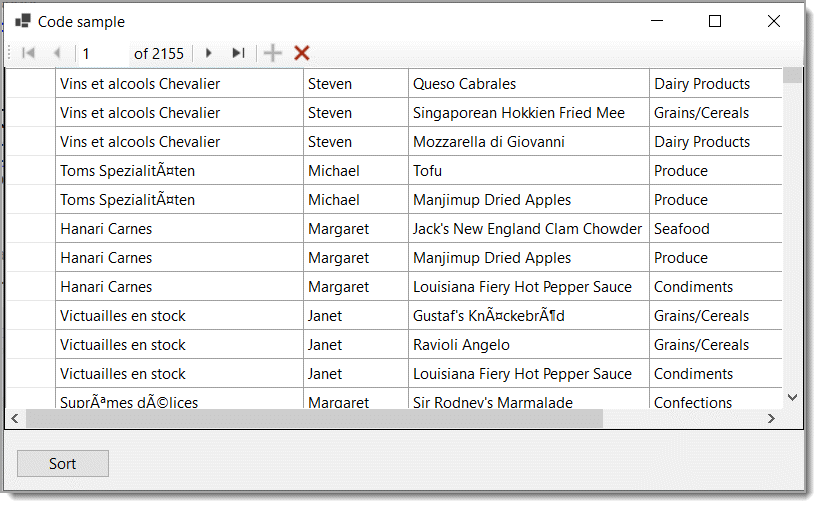

# About

Code sample to show how to provide sorting in a `DataGridView` with a component, `SortableBindingList` which gets data via EF Core, NorthWind database from the class project `NorthWindCoreLibrary`

